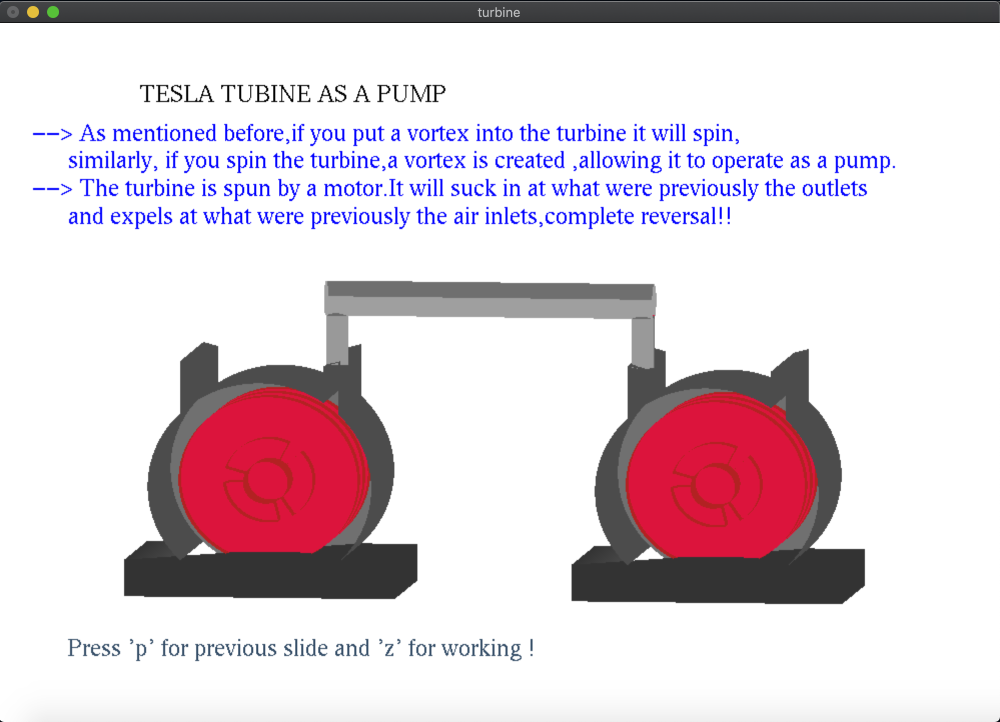

### Introduction
Design and visual illustration of a tesla turbine and its applications using OpenGl Api and C++

### Abstract
Nikola Tesla was an electrical engineer, mechanical engineer ,physicist, and futurist best known for his contributions to the design of the modern alternating current (AC)electricity supply system. But Tesla was a prodigious inventor who applied his genius to a wide range of practical problems. In 1913, Tesla received a patent for what he described as his most important invention. That invention was a turbine, known today as the Tesla turbine, the boundary layer turbine or the flat-disk turbine.
Interestingly, using the word "turbine" to describe Tesla's invention seems a bit misleading. That's because a turbine is generally a shaft with blades -- like fan blades -- attached to it. A turbine is also defined as an engine turned by the force of gas or water on fan blades. But the Tesla turbine doesn't have any blades. It has a series of closely packed parallel disks attached to a shaft and arranged within a sealed chamber. When a fluid is allowed to enter the chamber and pass between the disks, the disks turn, which in turn rotates the shaft. This rotary motion can be used in a variety of ways, from powering pumps, blowers and compressors to running cars and airplanes. In fact, Tesla claimed that the turbine was the most efficient and the most simply designed rotary engine ever designed.

### Video 

### Images

 
 
 
 
 
 
 
 
 